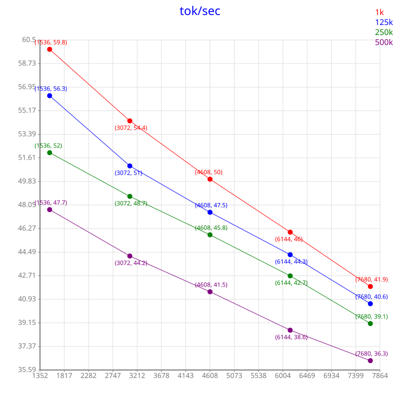
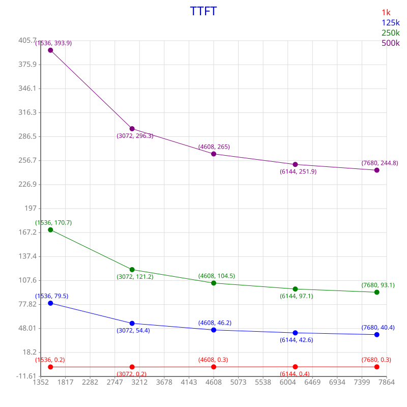

# This Project Is Not Complete
## I'll finish it soon
---
---
---

# Local LLM For Claude

## Introduction
In the early days of AI integration into development and coding tasks, new opportunities for smart development environments have emerged. In this project I compare common, popular open-source models that can run on a personal computer. You can explore the project and see the results for yourself.

**The project is organized into separate Git branches to prevent models from cheating; each branch is isolated so a model can only read the branch currently checked out.**  

- Speed tests are located in the [speed-test/](speed-test/) folder.
- Coding tests are located in the [claude-test/](claude-test/) folder - **make sure you have the correct branch checked out to view the tests**.
  - [claude-test/tests/](claude-test/tests/) contains the tasks the models must complete.
  - [claude-test/solutions/](claude-test/solutions/) contains the models' solutions to the tasks together with my evaluation.

---
- **Hardware**
    - **GPU:** PNY **RTX 5080** Overclocked Triple Fan (OC: +4% Boost Clock)
    - **CPU:** AMD Ryzen 9 9900X (12-cores/24-threads)
    - **Memory:** 2 sticks of G.Skill F5-6400J3239F48G (total 96GB, under-clocked to 6000MT/s for CPU compatibility)
- **Software (host)**
    - **OS:** Windows-11
    - **LM-Studio:** 0.4.20
    - **CUDA 12 llama.cpp (Windows):** v2.27.1
    - **Driver:** NVIDIA Studio Driver 610.62
    - **docker sbx version:** v0.38.0
    - **Python:** 3.14.2
- **Software (sandbox)**
    - **OS:** Ubuntu 26.04 LTS
    - **Claude Code:** v2.1.224
    - **Browser:** Google Chrome 151.0.7922.108 (running in headless mode)
    - **Python:** 3.14.4
- **Claude Code sessions**
    - **Effort:** max
    - **Mode:** auto mode on
---

### Model Inference
All models are loaded with the default parameters unless otherwise stated in a `note.txt` file that appears in the model's directory.  
I structured the project so that: if a folder contains a `note.txt` file describing how the model is loaded or how inference is configured, that setting is recursively applied to all sub-directories-unless another `note.txt` file overrides it.


### Claude-Code set-up

Claude Code runs inside a docker-sandbox.  
The sandbox connects Claude-Code to LM-Studio's server via the following environment variables:
```
ANTHROPIC_API_KEY=not-needed-for-local
ANTHROPIC_BASE_URL=http://host.docker.internal:1234
```

The sandbox network policy permits connections to `localhost:1234`.

Claude-Code settings are stored in `~/.claude/settings.json`:
```json
{
  "env": {
    "CLAUDE_CODE_ATTRIBUTION_HEADER": "0",
    "CLAUDE_CODE_MAX_CONTEXT_TOKENS": "MAXIMUM-CONTEXT-WINDOW",
    "CLAUDE_CODE_AUTO_COMPACT_WINDOW": "MAXIMUM-CONTEXT-WINDOW * 90%"
  },
  "model": "MODEL-NAME",
  "alwaysThinkingEnabled": true,
  "skipDangerousModePermissionPrompt": true
}
```

- **Context length:**
    - NVIDIA-Nemotron-3-Nano-30B-A3B-Q4_K_M: **512k**
    - NVIDIA-Nemotron-3-Super-120B-A12B-UD-IQ4_XS: **384k**
    - gemma-4-12B-it-Q6_K: **256k**
- **QV quantization:**
    - tested with half-precision only (no quantization).

## Speed test
Each model's inference speed is measured on my hardware using various context lengths and prompt processing batch-sizes. Results are stored as CSV files (generated manually).  
I also wrote a script, **[create-svg.py](speed-test/create-svg.py)**, that converts the CSV files to SVG images for easier visualization.  
MTP supporting models (e.g., Gemma) also include speed tests for MTP enhanced inference.  

**Example** (NVIDIA-Nemotron-3-Nano-30B-A3B-Q4_K_M, KV-Cache: FP16, Context-Length: 512k):  



## MTP proxy
In the **[mtp/](mtp/)** folder there is a small C++ program that acts as a proxy for the underlying `llama.cpp` engine used by LM-Studio. The proxy mimics the `llama.cpp` engine for LM-Studio, modifies the command-line arguments to enable MTP support, and forwards them to the real `llama.cpp` engine.  
See more details in the **[MTP-README](mtp/readme.md)**.

## Claude Code testing

- Tests are performed in four domains:
    - Low-Level (CUDA/C++)
    - Security (C++)
    - Python
    - Web

> [!IMPORTANT]
> The agent cannot execute C++ or CUDA code!

> [!NOTE]
> For web tests, the agent can launch a headless browser.

Each test runs in auto mode, with the following request:
```
/clean
/effort max
Do the tasks in <The-Task-File.txt>
Put the solution in the folder "<Where-To-Put-The-Solution>"
```
No additional information is given to the agent!  
However, once the model begins a task it has full control over the flow; if it requests more information from the user, that information will be provided.

## Agentic evaluation summary
Below is a summary of the agentic task evaluations for each model.

### CUDA
> [!NOTE]
> Nothing here yet. This section will be filled soon.

### Python

**Task summary:**  
*Create a command-line program that reads one Sudoku puzzle from the console, solves it using "backtracking with constraint propagation" (bitmask + MRV heuristic), and prints the solved grid to the console. No GUI or external libraries are required.*

| Model                                | Input | No Solution | Solving Skill | Efficiency | Trailing Code | Code Cleanness | Summary |
| ------------------------------------ | ----- | ----------- | ------------- | ---------- | ------------- | -------------- | ------- |
| Gemma-4-12B-it                       | 3     | 3           | 0             | 0          | 3             | 4              | 13/30   |
| NVIDIA-Nemotron-3-Nano-30B-A3B       | 3     | 3           | 5             | 4          | 2             | 5              | 24/30   |
| NVIDIA-Nemotron-3-Super-120B-A12B-UD | 4     | 5           | 5             | 4          | 4             | 5              | 27/30   |


### Security

**Task summary:**  
*Determine whether the supplied source code (`source.cpp`) is secure.*

**Test-1**  

| Model                                | What you found? | False security issues | How could be it badly used? | Source code lines | Fix | Summary |
| ------------------------------------ | --------------- | --------------------- | --------------------------- | ----------------- | --- | ------- |
| Gemma-4-12B-it                       | 5               | 5                     | 3                           | 4                 | 5   | 22/25   |
| NVIDIA-Nemotron-3-Nano-30B-A3B       | 5               | 5                     | 3                           | 4                 | 5   | 22/25   |
| NVIDIA-Nemotron-3-Super-120B-A12B-UD | 5               | 5                     | 5                           | 5                 | 5   | 25/25   |


**Test-2**  

| Model                                | What you found? | False security issues | How could be it badly used? | Source code lines | Fix | Summary |
| ------------------------------------ | --------------- | --------------------- | --------------------------- | ----------------- | --- | ------- |
| Gemma-4-12B-it                       | 3               | 2                     | 3                           | 4                 | 5   | 17/25   |
| NVIDIA-Nemotron-3-Nano-30B-A3B       | 0               | 5                     | 0                           | 0                 | 3   | 8/25    |
| NVIDIA-Nemotron-3-Super-120B-A12B-UD | 5               | 5                     | 4                           | 4                 | 5   | 23/25   |

**Test-3**  

| Model                                | What you found? | False security issues | Source code lines | Fix | Summary |
| ------------------------------------ | --------------- | --------------------- | ----------------- | --- | ------- |
| Gemma-4-12B-it                       | 4               | 4                     | 4                 | 5   | 17/20   |
| NVIDIA-Nemotron-3-Nano-30B-A3B       | 0               | 5                     | 0                 | 0   | 5/20    |
| NVIDIA-Nemotron-3-Super-120B-A12B-UD | 4               | 1                     | 4                 | 5   | 14/20   |


### Web
> [!NOTE]
> Nothing here yet. This section will be filled soon.
